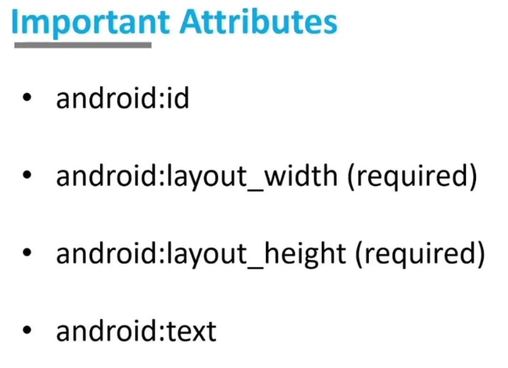

># Android Dev

## Apk:
It means <b>Android Application Package</b>...
It consits of :
* Application code(.dex files)
* Manifest file
* Assets
* Resource files

## Manifest :
AndroidManifest.xml is like a control room.Here, we ask permission for many things...

## res:
Contain our assets ...
Name :
* Can't start with number.
* Can't start with special char (only underscore)...
* Can't have spaces.

### drawable :
Our customized desired picture...

Allowed Extension for picture:
* png
* svg(copy paste hoi nah...vector asset diye import kora lage)
* jpg
* jpeg


## layout :
Contain activity xml files...

## minmap:
Contain app icon and launcher icon...

## values:
Contain colors.xml and strings.xml.

Colors:
* RGB--->hexadecimal format...
* RRGGBB --->combination...
* ARRGGBB ---> A indicates transparancy...(FFRRGGBB means color gota dekha jabe...00RRGGBB transparent hoi jabe ekbare...)

strings:
je nam use korbo bar bar sob nam gula ekhane rakha lage...
Ekhane change korle sob jaigai change hobe...


## XML:
eXtensible Markup Language

* case sensitive
* tags need not to be pre-defined
* self-discriptive
* Each layout must one root element

## View :
display information or content...
Text, images and buttons are views...

## ViewGroup:
invisible container that holds multiple Views and ViewGroups...
such as, 
* List View
* Grid View
* Table Layout
* Relative Layout
* Linear layout
* Frame Layout

## Layouts :

>Relative Layout : 
```java
xmlns:android="http://schemas.android.com/apk/res/android"
```
xlmns:(namespace URI) describes the android namespace.



```java
android:layout_width=""// hoi wrap_content:jototuk dorkar tototuk nei
//match_parent: parent er soman
//fixed --: jekono amader iccamoto...
android:layout_height=""
```
### Root activity layout e match_parent dite hoi karon full page dekhate hoi...

### Fixed unit : dp-->density pixel


center e jaite hoile center ...
align kore sese bane bame niche opore niya jai...

```
Relative layout e overlap hoi...
//Siblings er kaj korate hole to left to right use kora lage...
//opore niche nebar jonne layout above or top , below etc...
```
```java
<RelativeLayout xmlns:android="http://schemas.android.com/apk/res/android"
    xmlns:app="http://schemas.android.com/apk/res-auto"
    xmlns:tools="http://schemas.android.com/tools"
    android:layout_width="match_parent"
    android:layout_height="match_parent"
    tools:context=".MainActivity">

    <androidx.appcompat.widget.AppCompatButton
        android:id="@+id/btn1"
        android:layout_width="wrap_content"
        android:layout_height="wrap_content"
        android:layout_centerInParent="true"
        android:backgroundTint="#E91E63"
        android:text="Child 1"
        android:layout_above="@id/btn2"

        />
    <androidx.appcompat.widget.AppCompatButton
        android:id="@+id/btn2"
        android:layout_width="wrap_content"
        android:layout_height="wrap_content"
        android:layout_centerInParent="true"
        android:backgroundTint="#4CAF50"
        android:text="Child 2"
        android:layout_toRightOf="@id/btn1"
        />

</RelativeLayout>
```

> Linear Layout : 
ekar por arekta ....serially...
Linear e oivabe center nai..kintu gravity ace...


## Views in Android :

Basic Views : 
* Button
* TextView
* ImageView
    * Image show korte
    * Button er icon hisebe
        *png/svg format...
* EditText


> ImageView:
```
contentDescription joruri...
```

```java
<ImageView
        android:layout_width="match_parent"
        android:layout_height="300dp"
        android:background="@drawable/ic_launcher_background"
        android:contentDescription="@string/About"
        android:scaleType="fitXY"
        />
```


> TextView:
text er size debar somoi sp dibo..

* sp--->scalable pixels
font er jonne eta use hoi...

margin left right top bottom 4 dik theke hoi. ...dp unit use korbo...
```java
<TextView
        android:layout_width="match_parent"
        android:layout_height="wrap_content"
        android:text="@string/AboutUs"
        android:textSize="20sp"
        android:textStyle="bold"
        android:textAllCaps="true"
        />
```

>EditText : 
measurements of 1 M...
```java
<EditText
        android:layout_width="wrap_content"
        android:layout_height="wrap_content"
        android:ems="15"
        android:hint="@string/input"
        android:inputType="text"
        />
```

>Button
Use appcompatbutton for default button...


Bairer dike space dite hoile margin...vitorer dike space dite hoile padding...

## Java : 
> JDK :
```
JDK ---> java development kit, this inclues all necessary files like jvm, jre...javac ---> java compliler complie the java code into .class or byte code and jvm(java virtual machine) execute this file with the help of jre(java runtime environment)...
```

### Package :

Used to group related classes.Like a folder in a file directory.
We use it to avoid name conflicts and 

Two types :
* Built-in Packages(Packages from the Java API).
* User-defined Packages.


### DataTypes :
Used for representing the data in main memory(RAM) of the computer.

## Encapsulation :
```
Can be achieved :
* private keyword
* using public setter and getter methods to modify and view the variables values..
```

## Inheritance:
```
public--->anyone can inherit
protected--->from same package
private--->Can't inherit
```

>Final :
```
class with final keyword can't be inherited...
method ke final korle eta inheit hobe kintu redefine ba override kora jabe nah....
```

Multiple inheritance possible nah ...

## Method Overriding:
Runtime Polymorphism(Dynamic)...

If subclass(child class) has the same method as declared in the parent class, it is known as method overriding in Java...

When a method in a childclass has the same name, same parameters or signature, and same return type as a method in its super-class, then the method in the child-class is saild to override the method in the super-class.


```java
//Parent Class:
class Parent{
    void show(){
        System.out.println("I'm Parent");
    }
}

//Inherited Class :
class Child extends Parent{
//This method overrides show() of Parent
    @Override
    void show(){
        System.out.println("I'm Child");
    }
}

//Driver class:
class Main{
    public static void main(String[] args){
        //If a Parent type refernce refers to a Parent object, then Parent's show is called:
        Parent obj1 = new Parent();
        obj1.show();//I'm Parent

        //If a Parent type refernce refers to a Child object Child's show() is called. This is called RUN TIME POLYMORPHISM...
        Parent obj2 = new Child();
        obj2.show();//I'm Child
    }
}
```

We can't call any non-static method from a static method...

## this :

```
this is a reference variable that refers to th current object...Represents current class object...
```
Uses :
* This resolves ambiguity.
* this can be used to refer current class instance variable.
* this can be used to invoke current class method(implicitly).
* this() can be used to invoke current class constructor.
* this can be passed as an argument in the method call.
* this can be used to return the current class instance from the method.


## static :
Indicates that the particular member belongs to a type itself, rather than to an instance of that type...

Kono static kisu call korte obj create lage nah karon etai runtime memory allocate hoi nah...static/compile time e memory allocate hoi...

ekbar e toiri hoi, br bar create hoi nah...sudhu share hoi...


```java
class Counter{
    static int count = 0;//will get memory only once and retain its value

    Counter(){
        count++;//incrementing the value of static variable
        System.out.println(count);
    }
    public static void main(String[] args){
        //Creating objects and constructor is invoked:
        Counter c1 = new Counter();//1
        Counter c2 = new Counter();//2
        Counter c3 = new Counter();//3
    }
}
```

> final :

final means the value can't be modified in the future...

* final Variable :
```java
class FinalVariable{
    final int var = 50;
    var = 599;//This line would give an error...
}
```

* final Method :
```java
class FinalMethod{
    final void run(){
        System.out.println("Running");
    }
}
    //Final method can be inherited but can't be overridden
Class Honda extends FinalMethod{
    void run(){
        System.out.println("Running safely with 40 kmph");//Compile time error...
    }

    public static void main(String[] args){
        Honda honda = new Honda();
        honda.run();
    }
}
```

* final Class :

```java
final class FinalClass{}
//Final class  can't be inherited
class Honda1 extends FinalClass{//Compile time error
    void run(){
        System.out.println("Running safely with 100 kmph");
    }

    public static void main(String[] args){
        Honda1 honda = new Honda1();
        honda.run();
    }
}
```

## String :
ekhane split() jodi special jemon "+" diye kora lage emnei hobe nah er age"\\+" use kora lagbe...


## Components :
* Activities
* Services
* Broadcast Receivers
* Content Providers


> Activites :
Represents a single screen with a user interface...
have ui and ux means frontend and backend...

```java
public class MainActivity extends Activity{

}
```

> Services :
it runs in the background to perform long-running operations.

```java
public class MyService extends Service{

}
```


> BroadCast Receivers :

Respond to broadcast messages from other applications or from the system...

```java
public class MyReciever extends BroadcastReceiver{
    public void onReceive(context, intent){

    }
}
```

> Content Providers :
supplies data from one application to others on request. Requests are handled bu the methods of the ContentResolver class.

```java
public class MyContentProvider extends ContentProvider{
    public void OnCreate(){

    }
}
```


## Animation :
is a movement of object...

Two types :
* Scale animation
* Rotate animation


## Customizing EditText : 
First create a drawable resource file in drawable folder.
Then this :

```xml
<item android:state_enabled="true" android:state_focused="true">
        <shape android:shape="rectangle">
            <solid android:color="@color/edit_text_background_color"/>
            <stroke android:width="1dp" android:color="@color/edit_text_border_color"/>
            <corners android:radius="15dp"/>
        </shape>
    </item>
    <item android:state_enabled="true">
        <shape android:shape="rectangle">
            <solid android:color="@color/edit_text_background_color"/>
            <corners android:radius="15dp"/>
        </shape>
    </item>
```


## Making Gradiant and button :

custom_button_file
```java
<?xml version="1.0" encoding="utf-8"?>
<shape android:shape="rectangle"
    xmlns:android="http://schemas.android.com/apk/res/android">
<!--    <solid android:color="#4CAF50"/>-->
    <stroke android:color="#000000"
        android:width="1dp"/>
    <padding android:right="10dp" android:left="10dp" android:bottom="2dp" android:top="2dp"/>
    <corners android:radius="35dp"/>

    <gradient
        android:startColor="#E91E63"
        android:endColor="#FFEB3B"
        android:centerColor="#CDDC39"
        android:type="linear"
        />
</shape>
```
custom_button_states :
```java
<?xml version="1.0" encoding="utf-8"?>
<selector xmlns:android="http://schemas.android.com/apk/res/android">
    <item android:state_enabled="true" android:state_pressed="true">
        <shape android:shape="rectangle">
            <solid android:color="#2196F3"/>
            <corners android:radius="30dp"/>
            <stroke android:color="@color/edit_text_border_color" android:width="2dp"/>
        </shape>
    </item>
    <item android:state_enabled="false">
        <shape android:shape="rectangle">
            <solid android:color="@color/edit_text_background_color"/>
            <stroke android:color="@color/edit_text_border_color" android:width="2dp"/>
        </shape>
    </item>
    <item android:state_enabled="true" android:state_focused="true">
        <shape android:shape="rectangle">
            <solid android:color="@color/edit_text_background_color"/>
            <stroke android:color="@color/edit_text_border_color" android:width="2dp"/>
        </shape>
    </item>
    <item android:state_enabled="true" android:drawable="@drawable/custon_button">
        <shape android:shape="rectangle">
            <solid android:color="@color/edit_text_background_color"/>
            <stroke android:color="@color/edit_text_border_color" android:width="2dp"/>

        </shape>
    </item>
</selector>
```


```java
EditText = input;
TextView = output;
Button = button;

input = findViewById(R.id.input);
output = findViewById(R.id.output);

 button.setOnClickListener(new View.OnClickListener() {
    //Logic
    //output....
 }
```

>Concatenate the strings in the ArrayList
```java
StringBuilder stringBuilder = new StringBuilder();
    for(String mul:multiTable){
        stringBuilder.append(mul).append("\n");
    }
```

